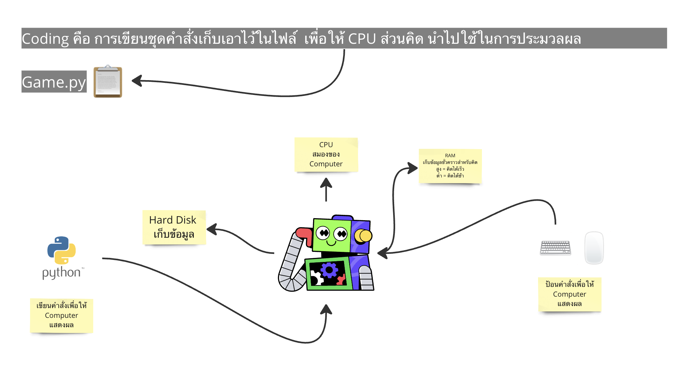
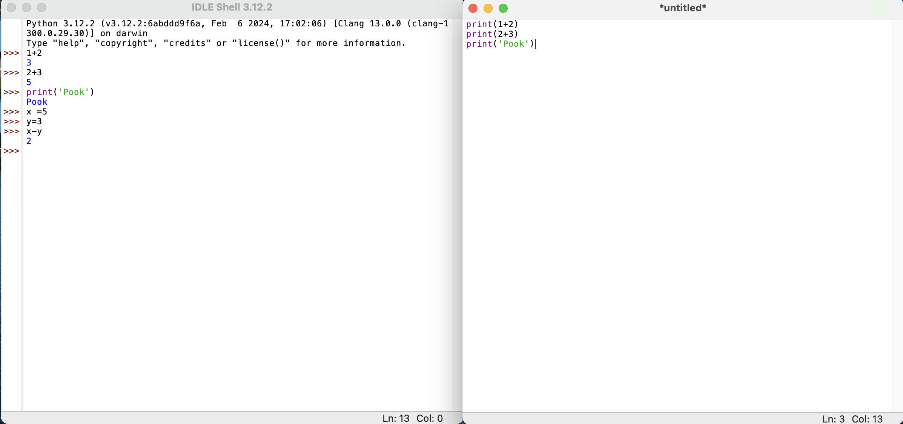
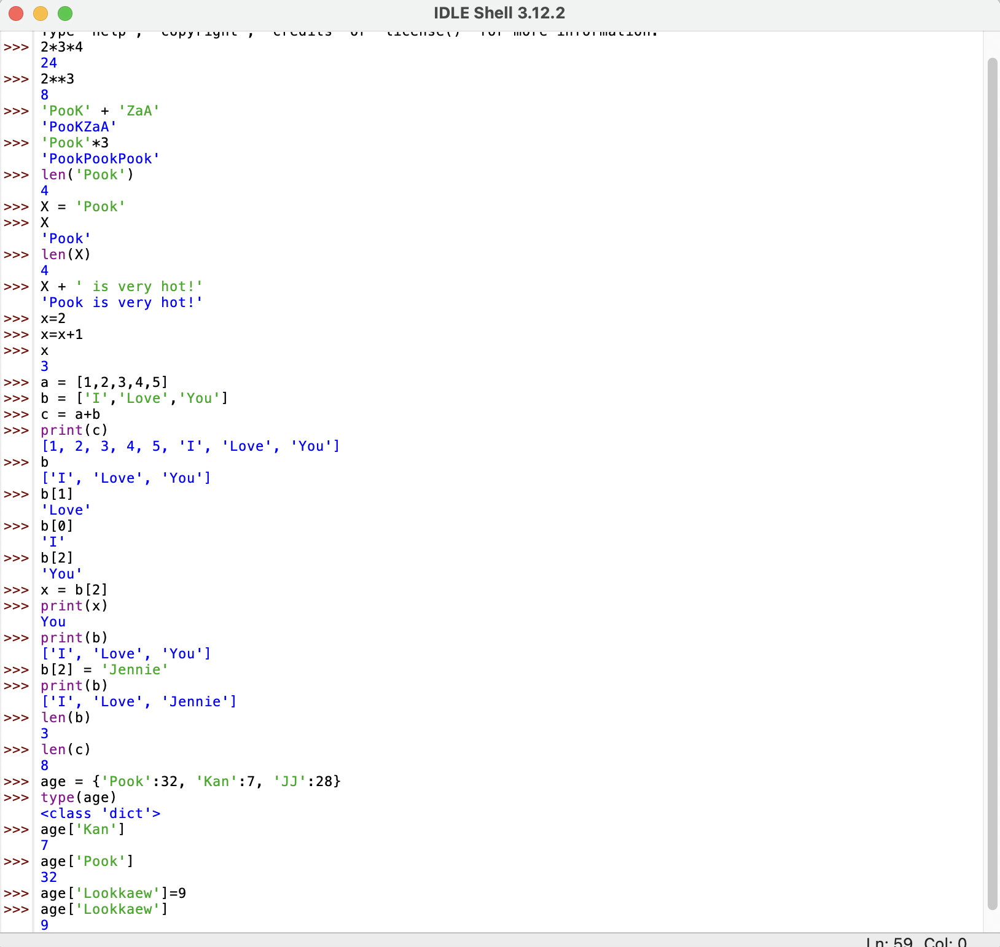

# Python-For-Beginner

สรุปสิ่งที่ได้เรียนรู้วันที่ 22 เมษายน 2567



ส่วนประกอบหลัก ๆ ของการเขียนโปรแกรมเบื้องต้น 

1. ข้อมูล (Data) 
ข้อมูลจะมีชนิดที่แตกต่างกัน รวมถึงวิธีจัดเก็บ ซึ่งถือเป็นส่วนสำคัญในการเขียนโปรแกรม
2. ตรรกะ (Logic) คือการตัดสินใจตามเงื่อนไข ว่าจะทำอย่างไรต่อไป เช่นการเขียนเกมตอบคำถาม หากผู้เล่นตอบถูกแล้ว โปรแกรมควรจะต้องนำคำถามข้อใหม่ขึ้นมาแสดงเพื่อให้สามารถเล่นต่อไปได้ 
3. ทำซ้ำ (Loop) การทำซ้ำของโปรแกรม ถือเป็นข้อดีอย่างหนึ่งของ Computer ที่นำมาใช้แทนมนุษย์ เพราะจะช่วยให้เราสามารถทำสิ่งซ้ำ ๆ ได้อย่างสะดวก
4. ฟังก์ชัน (Function) คือการเปลี่ยน Input ให้ออกมาเป็น Output ที่เราต้องการ เช่นหากเราใส่ข้อมูลว่า 1+2 ฟังก์ชันจะทำงานโดยเปลี่ยน Output ให้ออกมาเป็น 3 ดังภาพ



---

สรุปสิ่งที่ได้เรียนรู้วันที่ 23 เมษายน 2567

ข้อมูล [Data]

1. Types ประเภทของข้อมูล มี 4 แบบหลัก ๆ ได้แก่
- 1.1 ตัวเลขที่เป็นจำนวนเต็ม int เช่น 0,1,2...   -1,-2...
- 1.2 ตัวเลขที่เป็นทศนิยม float เช่น 1.23,1.80,-69.6969
- 1.3 ตัวอักษรและข้อความ Str (String) เช่น 'Pook' "Pook"
- 1.4 ข้อมูลประเภทจริงและเท็จ bool (boolean) True/False 

Notes: 
i.ข้อมูลที่เป็นจำนวนเต็ม สามารถทำการ + - * / ** (บวก ลบ คูณ หาร ยกกำลัง) ได้

ii.ข้อมูลที่เป็น Str สามารถ + * และหาจำนวนตัวอักษรได้ โดยใช้คำสั่ง len (length)


2. การจัดเก็บข้อมูลมีด้วยกัน 3 แบบหลัก ๆ ได้แก่
- 2.1 เก็บในตัวแปร (Variables) 

  ตัวอย่างเข่น

```
  X = 2 

  Y = 3

  Z = X+Y 
```

  เมื่อทำการสั่ง print(Z) >>> 5  

  หรือ 

```
  x = 'Pook' 

  y = 'likes Jennie' 

  z= x=y 

  print(z)

  ```
  
  => Pooklikes Jennie

  *** นี่ _ไม่ใช่_ สมการ แต่คือการ "ยัดค่า" ใส่ตัวแปร


- 2.2 เก็บใน List เอาข้อมูลมาเรียงกันเป็นแถว

```
  a = [1,2,3,4,5]


  b = ['I','Love','You']


  c = a+b 

  print(c)
```
  
  => [1,2,3,4,5,'I','Love','You'] (ไม่จำเป็นต้องเป็น Type เดียวกัน) 


  Notes: 
  i. เรา "ขอดู" ค่าใน List ได้ด้วยการระบุตำแหน่ง 


  b = ['I','Love','You'] คือลำดับที่ 0,1,2 ตามลำดับ


  b[1] = 'Love'

  ii. เรา "ขอ Copy" ค่าใน List ได้


  x = b[2]


  print(x) >>> You


  print(b) >>> ['I','Love','You']

  iii เราเปลี่ยนค่าใน List ได้ 

  b[2] = Jennie 

  print(b) >>> ['I','Love','Jennie']

- 2.3 เก็บข้อมูลใน Dictionary 

  ตัวอย่าง เก็บอายุคน 

  age {'Pook':32,'Lookkaew':9,'Kan':7}

  โดยเก็บเป็น Key และ Value

  อยากรู้ข้อมูลตรงไหน นำกุญแจไปไขตรงนั้น 

  Notes: 
  i. เราเพิ่มข้อมูล/อัปเดตข้อมูล ใน Dict ได้
  ii. ค่าของ Value จะเป็นอะไรก็ได้ Dict ก็ยังได้ ไม่จำเป็นต้องเป็นตัวเลขเสมอไป
  ตัวอย่างเช่น people = {'Pook': {'age':32, hint : ['ใส่แว่น,'ผมสั้น]}}

  ทดลองทำทั้งหมดได้ดังภาพ

  

---

สรุปสิ่งที่ได้เรียนรู้วันที่ 24 เมษายน 2567

Logic แบ่งออกเป็น 3 ประเภทหลัก ๆ คือ

1. ข้อความจริงเท็จ True/False (boolean Expressions)

ตัวอย่างเช่น 

```
x = 2

y = 2

z = 9
```

x == y 
คือการเช็กค่าว่า x และ y เท่ากันหรือไม่ ซึ่งเป็นจริงคือ True

x == z คือการเช็กค่าว่า x และ z เท่ากันหรือไม่ ซึ่งเป็นเท็จคือ False

x != z คือการเช็กค่าว่า x และ z เท่ากันหรือไม่ ซึ่งเป็นจริงคือ True 

นอกจากนี้ยังสามารถนำมาประยุกต์ใช้กับประเภทข้อความ

ตัวอย่างเช่น 
```
x = 'Pook'

y = 'Pook'

z = 'pook'
```

x == y คือการเช็กค่าว่า x และ y เท่ากันหรือไม่ ซึ่งเป็นจริงคือ True

x == z คือการเช็กค่าว่า x และ z เท่ากันหรือไม่ ซึ่งเป็นเท็จคือ False  ** _ข้อควรระวัง_ ตัวอักษรพิมพ์เล็กและพิมพ์ใหญ่ python อ่านค่าเป็นคนละตัวกัน 

'k' in x คือการเช็กว่า มีตัว 'k' อยู่ใน x หรือไม่ ซึ่งเป็นจริงคือ True 


2. เชื่อมเงื่อนไขเข้าด้วยกัน 
- 2.1 and x and y จะเป็นจริงต่อเมื่อ x และ y จริงทั้งคู่
- 2.2 or  x or y เมื่อ x หรือ y เป็นจริงหนึ่งอย่าง ประโยคนี้จะจริง
- 2.3 not กลับเป็นตรงข้าม 
ตัวอย่างเช่น 
```
x = 2

y = 2 

z = 9 
```
not(x==2) คือการเช็กในวงเล็บว่า x เท่ากับ 2 นั้นจริงหรือไม่ ซึ่งได้ผลเป็น True แต่เมื่อมาเจอ not ข้างหน้า ผลลัพธ์ของประโยคนี้จะออกมาเป็นเท็จหรือ False นั่นเอง 

3. การตัดสินใจตามเงื่อนไข 

if ...... else 

ตัวอย่างเช่น 

```
lives = 3
if lives > 0:
    print("Alive!")
else:
    print("Dead!")
    
```       

คือการให้เช็กว่าค่าของ Lives > 0 หรือไม่ ถ้ามากกว่าให้แสดงผลคำว่า 
Alive! แต่ถ้าไม่ใช่ ให้แสดงผลคำว่า Dead! 

----
Loops แบ่งออกเป็น 2 แบบหลักๆ 

1.คือการทำซ้ำด้วยจำนวนรอบที่แน่นอน for loop

ตัวอย่างเช่น 

```  
a = [0,1,2,3,'Pook']
for i in a:
 print(i)
```  
คือการสั่งให้โปรแกรมทำงานซ้ำ โดยการแสดงผลใน a ออกมาทั้งหมด ซึ่งมีจำนวนที่แน่นอนเนื่องจากข้อมูลภายใน a มีจำนวนที่แน่นอน

```
for i in range(4):
    print(i)
```

คือการสั่งให้โปรแกรมทำงานซ้ำ โดยการแสดงผลข้อมูล 4 ลำดับ ซึ่งเป็นตัวเลข 0,1,2,3 python จะเริ่มจากตำแหน่งที่ 0 เสมอ


2. การทำซ้ำตราบใดที่เงื่อนไขยังคงเป็นจริงอยู่ While loop 

```
x = 4
while x > 0:
    print(x)
    x = x - 1
```
คือการสั่งให้โปรแกรมทำงานซ้ำ โดยการแสดงผลข้อมูลออกมา หากเงื่อนไขยังคงเป็นจริงอยู่ ซึ่งจะแทนที่ค่า x ไปเรื่อย ๆ จนกว่าจะเป็นเท็จ นั่นคือ จากโค้ดข้างต้น จะแสดงผลเลข 4,3,2,1 ตามลำดับ 


เราสามารถใช้ประโยชน์จาก infinite loop ได้ โดยนำเงื่อนไขเข้ามาประยุกต์ 

ตัวอย่างเช่น 

```
while True:
    name = input("ชื่ออะไรจ๊ะ? : ")
    if name == 'exit' :
        print("ออกจากโปรแกรม")
        break
    print("สวัสดี " + name)
```

คือการให้โปรแกรมทำงานซ้ำไปเรื่อย ๆ ไม่จำกัด จนกว่าจะระบุคำว่า 
exit ซึ่งถือเป็นการจบโปรแกรมนั่นเอง 

---

สรุปสิ่งที่ได้เรียนรู้วันที่ 25 เมษายน 2567

1. Function คือกระบวนการที่เปลี่ยน Input ไปเป็น Output ที่ต้องการ โดยมี Step การทำงาน 2 Step ด้วยกันคือ 
- 1.1 นิยามของฟังก์ชัน หรือที่เรียกว่า Define โดยใช้สัญลักษณ์ตัวย่อ

 def ชื่อฟังก์ชัน(inputs):
 return outputs 

 - 1.2 การเรียกใช้ฟังก์ชัน (Call)

 a = ชื่อฟังก์ชัน(x=1,y=2)

 ตัวอย่างเช่น การเขียนฟังก์ชันทักทาย Pook 

#นิยาม
```
def greet_pook():
    print('Hello Pook')
```
#เรียกใช้ (call)
```
greet_pook()
```

ตัวอย่างเช่น การเขียนฟังก์ชันทักทายสาว ๆ 
WLB


สร้างฟังก์ชันให้รับ Input เป็นชื่อสาว ๆ WLB และสั่งให้ทักทาย
```
def greet(name):
     print('Hello '+name)
```

เรียกใช้ฟังก์ชันและระบุชื่อสาว ๆ WLB 
```
greet('Jackie')  
greet('Por')
greet('Ple')
greet('Bumebim')
greet('Nan')
greet('Kaofang')
greet('Tonmint')
```

นอกจากนี้ เรายังสามารถเขียนฟังก์ชันสำหรับการคำนวณทางค
ณิตศาสตร์โดยใช้เงื่อนไขเข้ามาประยุกต์รวมกันได้ด้วย

ตัวอย่างการเขียนฟังก์ชันยกกำลัง 2 และการเรียกใช้

```
def yok2(x):
    return x**2

a = yok2(5)
print(a)
```

ตัวอย่างการเขียนฟังก์ชัน x/y โดยนำ if เข้ามากำหนดเงื่อนไข และการเรียกใช้

```
def x_haan_duay_y(x,y):
    if y ==0:
        print('หารด้วยศูนย์ไม่ได้')
        return 'ลองใหม่อีกครั้ง'
    return x/y

print(x_haan_duay_y(2,3))
print(x_haan_duay_y(2,0))
```

2. Methods คือฟังก์ชันที่คนเขียน Python สร้างไว้สำหรับ objects หลัก ๆ อยู่แล้ว เช่น str,list,dict สามารถเรียกใช้ได้เลย 

- 2.1 lower , upper , find

  ตัวอย่างเช่น a = 'POOK'

  a.lower() คือการเปลี่ยน a ให้กลายเป็นตัวพิมพ์เล็ก

  a.upper() คือการเปลี่ยน a ให้กลายเป็นตัวพิมพ์ใหญ่

  a.find('K') => 3 ตือการค้นหา K ใน a ซึ่งอยู่ตำแหน่งที่ 4 (Pythonนับจาก 0,1,2,3)


- 2.2 split 

  ตัวอย่างเช่น b = 'Pook is happy' 

  b.split() => ['Pook','is','happy'] จะได้ลิสต์แยกของตัวอักษรแบ่งตามช่องว่าง

- 2.3 strip , lstrip , rstrip

  ตัวอย่างเข่น c = '   Pook   '

  c.strip() => 'Pook' คือคำสั่งปลดพื้นที่ว่างออก ซึ่งเราสามารถเลือกปลดแค่ฝั่งซ้าย หรือฝั่งขวาก็ได้ ด้วยคำสั่ง 

  c.lstrip() => 'Pook   ' 

  c.rstrip() => '   Pook' 

- 2.4 pop

  ตัวอย่างเช่น x = ['a','b','c']

  x.pop() => 'c' หลุดออกจาก x 

  x.pop(0) => 'a' ตำแหน่งที่ 0 หลุดออกจาก x

- 2.5 join

  ตัวอย่างเช่น names = ['Pook','Lookkaew','Kan']

  ' '.join(names) => 'PookLookkaewKan'

  '_'.join(names) => Pook_Lookkaew_Kan

  '♡'.join(names) => Pook♡Lookkaew♡Kan


---

สรุปสิ่งที่ได้เรียนรู้วันที่ 25 เมษายน 2567


ได้ทดลองนำคำสั่งที่เรียนมาทั้งหมด มาเขียนเป็นเกมทายชื่อแบบง่าย 

ซึ่งได้เรียนรู้ว่า ก่อนจะทำการเขียนโปรแกรมนั้น เราจะต้องเรียนรู้ Logic ต่าง ๆ ของโปรแกรมอย่างเป็นลำดับขั้นก่อน คือถ้าเราจะเขียนเกมทายชื่อ เราก็ต้องไล่ขั้นตอนว่า เกมของเราจะทำเดินไปอย่างไร 

ตัวอย่างเช่น 

เริ่มแรกเรากำหนดว่า เกมของเราจะต้องมีส่วนของ

คะแนนเริ่มต้น
score = 0 

ชีวิตเริ่มต้น lives = 3 

จะต้องมีการสุ่มคำ และจะต้องมีการแสดงเบาะแส clue = ['?','?',...]

หลังจากนั้นทำการ เดาตัวอักษรที่อยู่ภายในชื่อ

ถ้าทายตัวอักษรถูก ให้ทำการแทนที่ตัวอักษรนั้นลงใปในเบาะแส 
if อยู่ใน clue = ['?','?','?','k'] 

ถ้าทายได้ครบทุกตัวอักษร ไม่เหลือ '?' แล้ว 
ให้บวกคะแนนเพิ่ม 1 คะแนน 

ถ้าทายไม่ถูก 1 ตัวอักษร lives จะต้องลด 1

เมื่อ lives ==  0 ถือว่าจบเกม 


เมื่อเราเริ่มร่างสิ่งที่เราต้องการออกมาแล้ว จึงนำส่วนต่าง ๆ ไปเขียนเป็น pseudo code เพื่อวางโครงสร้างเกมของเรา และค่อย ๆ เขียนโค้ดลงไป 

```
#pseudo-code
import random

#ตัวแปรที่ระบุสถานะของเกม
score = 0
lives = 3
words = ['jackie','por','ple','bumebim','nan','kaofang','nat','tonmint','pook']

def update_clue(guess,secret_word,clue):
    #guess ไล่ไปทีละคัวอักษรใน secret_word ดูว่ามีตัวไหนบ้างตรงกับที่ทาย
    for i in range(len(secret_word)):
        #ถ้าทายตรงกับตัวไหน ก็อัปเดตตำแหน่งนั้น
        if guess == secret_word[i]:
            clue[i] = guess
    win = ''.join(clue) == secret_word
    return win #ทายจนหมด '?' แล้ว  -> True, ยังเหลือ -> False

#ตราบใดที่ยังมีคำให้ทายอยู่ และ ชีวิตยังเหลือ --> เล่นต่อไป
while (len(words) > 0) and (lives > 0):
    #สุ่มคำจาก words แล้วดึงคำนั้นออกจาก List
    random.shuffle(words)
    secret_word = words.pop()
    clue = list('?'*len(secret_word)) #จำนวนเท่ากับตัวอักษรของ secret_word

    #ตราบใดที่ยังทายคำนี้ไม่เสร็จหรือชีวิตยังไม่หมด
    while True:
        print(clue)
        print('ชีวิตที่เหลือ: ' + str(lives))
        guess = input('ทายตัวอักษรสิจ๊ะ: ')

        #check ว่าตัวอักษรที่ทาย อยู่ใน secret_word หรือไม่?
        if guess in secret_word:
            win = update_clue(guess,secret_word,clue)
            if win:
                print('เย้!! คนนั้นก็คือ: '+secret_word)
                score = score + 1
                print('Score: ' + str(score))
                break #ทายคำนี้ชนะแล้ว
        else: #ที่ guess มา ไม่อยู่ใน secret_word
                    print('ผิด!! โดนฟันหนึ่งฉับ')
                    lives = lives - 1
                    if lives == 0:
                        print('เลือดหมดตัว เจ้าแพ้แล้ว!! คนนั้นก็คือ : ' + secret_word)
                        break #เกมจบแล้ว

print('Final score: ' + str(score))
print('Game end!')
```

